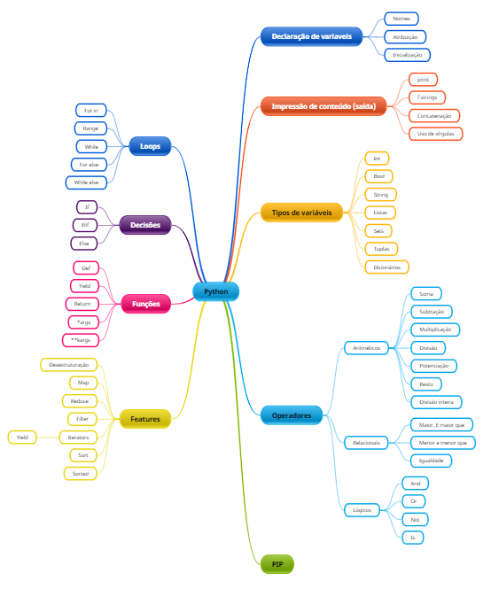

# Curso Python - Básico ao intermediário Youtube

## Roadmap

# Aula 0

## Zen of python

    import this
    print(this)

    '''
    The Zen of Python, by Tim Peters

    Beautiful is better than ugly.
    Explicit is better than implicit.
    Simple is better than complex.
    Complex is better than complicated.
    Flat is better than nested.
    Sparse is better than dense.
    Readability counts.
    Special cases aren't special enough to break the rules.
    Although practicality beats purity.
    Errors should never pass silently.
    Unless explicitly silenced.
    In the face of ambiguity, refuse the temptation to guess.
    There should be one-- and preferably only one --obvious way to do it.
    Although that way may not be obvious at first unless you're Dutch.
    Now is better than never.
    Although never is often better than *right* now.
    If the implementation is hard to explain, it's a bad idea.
    If the implementation is easy to explain, it may be a good idea.
    Namespaces are one honking great idea -- let's do more of those!
    '''

## Aula 1

### Declaração de variáveis

    a = 'Hello World !!!'
    b = "Nova declaração"

    print(a)
    print(b)

    b = a

    print(b)

## Aula 02

### Comentários

    # Comentário de uma linha

    a = 'Hello World !!!' # comentário de uma linha em sequência ao script
    b = "Nova declaração"

    '''
    Comentário de múltiplas
    linhas
    '''

    c = '''
    Comentário de múltiplas
    linhas atribuído a uma variável
    '''
    d = # Gerará um erro

    print(a)
    print(b)
    print(c)
    print(d)

## Aula 03

### Strings

    #Variáveis declaradas

    a = "Hello World !!!"
    b = 10
    c = 10.0

    #Impressão

    print("Hello world diretamente no argumento da função")
    print(a)
    print('Texto', a)
    print('Texto concatenado ' + a)
    # print('Texto concatenado ' + b) # Não pode concatenar non srings com string. é necessário o parse antes.
    print('Texto concatenado ' + str(b))

    # Impressões formatadas

    print("Texto formatado: %s" %a)
    print("Texto formatado: %s e %d" %(a, b))
    print("Texto formatado: %s e %f" %(a, c))

    # Usando .format

    print("Texto formatado: {}".format(a))
    print("Texto formatado: {} e {}".format(a, b))
    print("Texto formatado: {} e {}".format(a,b))

    # f strings

    print(f'{a} - {b} - {c:.2f}')
    print(f'{a} - {b + 100} - {c:.2f}')

## Um pouco sobre como o Python trata as variáveis internas

### TIPOS PRIMITIVOS

**_Tipo Primitivo_** são os tipos de dados mais simples, isto é, a informação em sua forma mais primitiva. Bons exemplos de valores primitivos são os caractere, os número, o valor True e o False e etc. A documentação do Python não trata os tipos de dados elementares (primitivos) com a nomenclatura normalmente encontrada na documentação da maioria das linguagens: Tipo Primitivo. Na documentação oficial, os tipos primitivos são chamados de tipos **_built-ins_** ou então, **_tipos construídos_**. Essa nomenclatura é utilizada para indicar que estamos utilizando informações que foram definidas, por padrão, através de classes dentro da Máquina Virtual do Python.

Nesse momento, chamaremos de Tipos Primitivos as informações em sua forma mais simples, porém, é importante saber que para o Python, **não há tipo primitivos**, mas sim, estruturas de dados que estão definidas, na maior parte das vezes, dentro da própria Máquina Virtual do Python.

É normal que as linguagens de programação tenham um conjunto de tipos chamados de: tipos primitivos. Devemos pensar nessa classificação como sendo os tipos primários de informações, como por exemplo, o tipo numérico. Como sabemos, todo número é constituído por algarismos. Dessa forma, o tipo numérico pode ser qualquer valor que seja composto por 1 ou mais caracteres numéricos.

Dessa forma, isto é, tendo a certeza de que uma variável declarada como sendo do tipo numérico inteiro sempre terá um valor numérico válido, somos capazes de desenvolver funções especificas que manipulam esse tipo de dado de maneira muito mais eficiente e sem a necessidade de verificação se o tipo da informação contida em determinada variável é válido.

Da mesma forma, temos o tipo de dado que representa conjuntos de caracteres, que na programação, é comumente chamado de String e o Python o chama de str. As String são capazes de armazenar conjuntos de caracteres que estão dispostos numa determinada ordem. Todas as vezes que estivermos manipulando dados que contenha caracteres - o tipo mais primitivo, isto é, a maneira mais abstrata para representarmos caracteres - estaremos utilizando uma variável definida como sendo do tipo str.

O fato de o Python não trabalhar com tipo primitivos diretamente, deve-se ao fato de que em Python, tudo são objetos. Dessa forma, o que chamaríamos de primitivo é, em Python, representado como uma e toda informação será, um objeto propriamente dito. A seguir, temos a lista dos principais tipos built-ins da linguagem Python:

- int - para números inteiros
- str - para conjunto de caracteres
- bool - armazena True ou False
- list - para agrupar um conjunto de elementos
- tupla - semelhante ao tipo list, porém, imutável
- dic - para agrupar elementos que serão recuperados por uma chave

O Python fornece um conjunto de tipos básicos bastante amplo e que normalmente, atendem a maioria das necessidades. Cada tipo citado, possui um conjunto de funções e métodos que permitem manipularmos as informações, contidas na variável, de maneira bastante eficiente.

Sempre que formos criar um novo tipo de dados, acabaremos utilizando os tipos básicos da linguagem, como por exemplo, o tipo `int`, ou então, o tipo `str` e assim por diante.

DIFERENÇA ENTRE TIPO E VALOR

O valor é qualquer informação, seja um número, texto, música, vídeo e etc. O tipo por sua vez, é a estrutura da informação e a forma de classificarmos os dados.

Todo valor numérico deve ser capaz de ser somado a outro valor, ou então, subtraido. Da mesma forma que todo texto, deve ser capaz de ser concatenado a outro, isto é, ser juntado a outro conjunto de caracteres.

O tipo da informação deve ser pensado como uma forma de classificarmos as diferentes informações e assim, termos a disposição um conjunto de funções para tratarmos e modificarmos os valores.

É importante saber que somos capazes de criar novos tipos de dados a qualquer momento, e a programação orientada a objetos é, em sua definição mais primitiva, uma maneira de criarmos novos tipos abstratos e definirmos, na estrutura da classe, funções, métodos, verificações que busquem tratar valores que tenham uma mesma estrutura.

Em Python tudo é tratado como objeto

Existem 4 tipos para classificação para os tipos de informações.

- Tipos simples - constituidos por simples blocos, como int() e float()
- Tipos de contêiner - objetos capazes de conter outros objetos
- Tipos de código - objetos encapsuladores de elementos dos nosso programas
- Tipos internos - tipos que serão utilizados durante a execução do nosso programa

## Tipos

    # string

    string_1 = 'Esta é uma string'

    #integers

    int_1 = 10
    print(int_1)
    print(type(int_1))

    #floats

    float_1 = 10.00
    print(float_1)
    print(type(float_1))

    #Boolean

    bool_1 = True
    print(bool_1)
    print(type(bool_1))

    #tuple

    tuple_1 = (1,)
    print(tuple_1)
    print(type(tuple_1))

    #list

    lista_1 = [1,2,3,4,5,'item 1', False, [1,2,3]]
    print(lista_1)
    print(type(lista_1))

    #Dict

    dic_1 = {'item_1':'valor 1','item_2':10, 'item_3':10.00, 'item_4':True, 'item_5':{'item_aninhado_1':'valor aninhado 1'}}
    print(dic_1)
    print(type(dic_1))

    #set

    set_1 = {1,2,3,True,False,'valor',(1,2)}
    print(set_1)
    print(type(set_1))

    ### Resultados

    10
    <class 'int'>
    10.0
    <class 'float'>
    True
    <class 'bool'>
    (1,)
    <class 'tuple'>
    [1, 2, 3, 4, 5, 'item 1', False, [1, 2, 3]]
    <class 'list'>
    {'item_1': 'valor 1', 'item_2': 10, 'item_3': 10.0, 'item_4': True, 'item_5': {'item_aninhado_1': 'valor aninhado 1'}}
    <class 'dict'>
    {False, 1, 2, 3, (1, 2), 'valor'}
    <class 'set'>

## Strings

    s1 = '    hello world !!!    '
    s2 = 'Hello again ...'

    print(s1.capitalize())
    print(s1.title())
    print(s2.lower())
    print('Strip',s2.strip())
    print('rstrip',s2.rstrip())
    print('lstrip',s2.lstrip())
    print('ljust',s2.ljust(3))
    print('rstrip',s2.rjust(3))
    print('Replace',s2.replace('l','*'))
    print('Remove Suffix',s2.removesuffix('...'))
    print('Remove Prefix',s2.removeprefix('Hel'))
    print(s2.upper())
    print("Number of 'a'", '=', s2.count('a'))
    print("Number of 'l'", '=', s2.count('l'))
    print("Number of ' '", '=', s2.count(' '))
    print(s2.encode())
    print(s2.endswith('.'))
    print(s2.startswith('Hel'))
    print('Position','=',s2.find('a'))
    print('Is digit = ',s2.isdigit())
    print('Index = ',s2.index('o'))
    print(s2.isprintable())
    print(s2.isnumeric())

## Numbers, int and float

    n1 = 10
    n2 = 20.10

    #int

    print(n1.bit_count())
    print(n1.bit_length())
    print(n1.conjugate())
    print(n1.as_integer_ratio())

    # Float

    print(n2.fromhex('10.00'))
    print(n2.__add__(20))
    print(n2.__abs__())
    print(n2.__ceil__())
    print(n2.__floor__())
    print(n2.__lt__(10))
    print(n2.__gt__(10))
    print(n1.__bool__())
    print(n1.__format__('.2f'))
    print(n1.__dir__())
    print(n1.__hash__())

## Boolean

    b1 = False
    b2 = True

    print(type(b1))
    print(type(b2))

    print(b1)
    print(b2)

    print(b1.bit_count())
    print(b2.bit_count())

    print(str(b1))
    print(str(b2))

    b12s1 = str(b1)
    b22s2 = str(b2)

    print(type(b12s1))
    print(type(b22s2))

    print(b12s1.upper())
    print(b22s2.lower())

# Listas

    l1 = [1]

    print('Lista 1:',l1)
    print(type(l1))

    # Métodos disponíveis
    print(dir(l1))

    # Append - não retorna o valor removido
    result_after_append = l1.append(2)
    print('lista 1 (append):', l1)
    print('res_append: ',result_after_append)

    # Insert - não retorna o valor removido
    result_after_insert = l1.insert(0,'entrou antes do valor que estava no index 0')
    print('lista 1 (insert):', l1)
    l1.insert(2,'entrou depois do valor que estava no index 1')
    print('lista 1 (insert):', l1)
    print('res_insert: ',result_after_insert)

    # Pop - retorna o valor removido
    result_after_pop = l1.pop()
    print('Lista 1 (Pop):', l1)
    print('res_pop: ',result_after_pop)
    result_after_pop_2 = l1.pop(0)
    print('Lista 1 (Pop):', l1)
    print('res_pop: ',result_after_pop_2)

    # Remove - não retorna o valor removido
    result_after_remove = l1.remove('entrou depois do valor que estava no index 1')
    print('Lista 1 (remove):', l1)
    print('res_remove: ',result_after_remove)

    # Count - retorna a quantidade do valor argumentado

    l1.append(2)
    l1.append(2)
    l1.append(3)
    l1.append(3)
    l1.append(3)
    l1.append(3)
    l1.append(5)
    l1.append(4)
    print('Lista 1 (after appends):', l1)
    print('Qtd de valores 3 na lista ==',l1.count(3))

    # Index - retorna o indice do valor argumentado

    print('Indice do item 4 ==', l1.index(4))
    print('Indice do item 5 ==',l1.index(5))

    # Reverse - não retorna valor. Inverte a lista

    print('Reversed l1:', l1.reverse())
    print('lista 1',l1)
    print('Reversed l1 again:', l1.reverse())
    print('lista 1',l1)

    # Sort - não retorna valor. ordena a lista
    print('lista 1 (Sort)',l1)
    print('Sort l1 (Sort): ', l1.sort())
    print('lista 1 (Sort)',l1)

    # Sorted - retorna a lista ordenada, porém não a ordena permanetemente

    print('lista 1: ',l1)
    l1.append(4)
    l1.append(3)
    l1.append(1)
    print('lista 1: ',l1)
    print('lista 1(sorted): ',sorted(l1))
    print('lista 1 after sorted: ',l1)

    # Copy - Faz uma cópia independente da lista

    l2 = l1.copy()

    print('Lista 1(copy):',l1)
    print('Lista 2 (copy):',l2)
    print(l1 == l2)
    print(id(l1) == id(l2))
    l1.append('item teste')
    print('Lista 1(copy):',l1)
    print('Lista 2 after append(copy):',l2)

    # Extend - Insere os valores da lista extendida. Não possui retorno
    l3 = ['batata','feijão','arroz']
    print('Lista 1 (extend)',l1.extend(l3))
    print('Lista 1 (extend)',l1)

    # Clear
    print('Lista 1 before clear(clear):',l1)
    print('Res l1 after clear: ',l1.clear())
    print('Lista 1 before after(clear):',l1)

# Tuplas

    t1 = (1,1,1,10,3,3,5,6,3) # Com um elemento é necessária a inserção da virgula
    print('Tupla 1:',t1)
    print('Tipo da tupla:',type(t1))
    print(dir(t1))
    print('Contador de itens 1 : ',t1.count(1))
    print('Indice do item 10: ',t1.index(10))

    print('Recuperando valores atômicos da tupla: ',t1[3])
    # Se tentar inserir um novo valor em qq indice, ocorrerá um erro: TypeError: 'tuple' object does not support item assignment
    t1[3] = 20
    print('Tupla 1:',t1)

# Sets

    s1 = {1,2,3,4,4,5,6} # valores repetidos são ignorados

    print('Set 1: ', s1)
    print('Tipo: ', type(s1))
    print('Métodos ', dir(s1))

    # Add, Não retorna valor

    print(s1.add(7))
    print('Set 1 após add: ',s1)

    #Pop - retorna o valor o removido

    print('Printando o retorno após o pop: ',s1.pop())
    print('Set 1 após pop: ',s1)
    print('Printando o retorno após o pop: ',s1.pop()) #Retira o primeiro item do set
    print('Set 1 após pop: ',s1)

    # Remove

    print('Printando o retorno após o remove: ',s1.remove(4))
    print('Set 1 após remove: ',s1)

    # Update

    s2 = {10, 20, 30, 40, 50, 60, 200}
    print('Set 1 antes do update: ',s1)
    print('Set 2 antes do update: ',s2)

    print('Retorno após o update de s1 com s2: ', s1.update(s2))

    print('Set 1 após do update: ',s1) #s1 alterado permanentemente
    print('Set 2 após do update: ',s2)

    # Union - Não altera os sets

    s3 = {100,200,300,400}
    print('Set 1 antes do union: ',s1)
    print('Set 3 antes do union: ',s3)
    print('Resultado do union: ',s1.union(s3))
    print('Set 1 após do union: ',s1)
    print('Set 3 após do union: ',s3)

    # Difference - Um conjunto - outro conjunto - Não altera nenhum dos sets envolvidos

    print("S1 - S3: ",s1.difference(s3))
    print("S3 - S1: ",s3.difference(s1))
    print('Set 1 após difference: ',s1)
    print('Set 3 após difference: ',s3)

    # Interesection - Não altera nenhum dos sets envolvidos

    print("S1 and S3: ",s1.intersection(s3))
    print("S3 and S1: ",s3.intersection(s1))
    print('Set 1 após intersection: ',s1)
    print('Set 3 após intersection: ',s3)

    # Difference_update - altera os sets envolvidos

    print('Set 1 antes de difference: ',s1)
    print('Set 3 antes de difference: ',s3)
    print("S1 - S3: ",s1.difference_update(s3))
    print('Set 1 após difference_update: ',s1)
    print('Set 3 após difference_update: ',s3)

    #Intersection_Update - altera os sets envolvidos permanentemente

    s4 = {5,6,40, 1000, 2000}
    print('Set 1 antes de intersection: ',s1)
    print('Set 4 antes de intersection: ',s4)
    print("S1 and S3: ",s1.intersection_update(s4))
    print('Set 1 após intersection: ',s1)
    print('Set 4 após intersection: ',s4)

    # Symetric_difference - Remove valores que existem simultaneamente nos dois conjuntos e retorna o restante

    s5 = {2,3,5,40,200,100,1000}
    print('Set 1 antes de symmetric_difference: ',s1)
    print('Set 5 antes de symmetric_difference: ',s5)
    print("S1 - S3: ",s1.symmetric_difference(s5))
    print('Set 1 após symmetric_difference: ',s1)
    print('Set 5 após symmetric_difference: ',s5)

    # Symetric_difference_update - Atualiza permanentemente, não retorna valor algum

    print('Set 1 antes de symmetric_difference_update: ',s1)
    print('Set 5 antes de symmetric_difference_update: ',s5)
    print("S1 - S3: ",s1.symmetric_difference_update(s5))
    print('Set 1 após symmetric_difference_update: ',s1)
    print('Set 5 após symmetric_difference_update: ',s5)

    # Discard - Elimina um item do set, não retorna valores. Semelhante ao remove

    print('Set 1 (Discard):',s1)
    print(s1.discard(100))
    print('Set 1 (Discard):',s1)

    # Copy
    print('Set 1 (Copy):',s1)
    s6 = s1.copy()
    print('Set 6 (Copy):',s6)
    print('Id s1: ',id(s1))
    print('Id s6: ',id(s6))

    # Clear, remove todos os elementos do set, não retorna nada
    print('Set 1 (Clear):',s1)
    print('Clear s1: ', s1.clear())
    print('Set 1 (Clear):',s1)

# Dicionários

    # dict

    d1 = {'el_1': 'Valor 1'}

    print('Dict 1:',d1)
    print(dir(d1))

    # Update
    print('Dict 1 (update) antes:',d1)
    print('retorno de update: ', d1.update({'el_2':'Valor 2','el_3': 'Valor 3'}))
    print('Dict 1 (update) depois:',d1)

    # Get

    print('Dict 1 (get) antes:',d1)
    print('retorno de Get: ', d1.get('el_2'))
    print('retorno de Get: ', d1.get('el_20','Chave não encontrada'))
    print('Dict 1 (get) Depois:',d1)

    # Pop, Retorna o valor deletado

    print('Dict 1 (pop) antes:',d1)
    print('retorno de pop: ', d1.pop('el_2'))
    print('retorno de pop: ', d1.pop('el_20', 'Retorno default'))
    print('Dict 1 (pop) depois:',d1)

    # Popitem, Retorna o valor deletado

    print('Dict 1 (popitem) antes:',d1)
    print('retorno de popitem: ', d1.popitem())
    print('Dict 1 (popitem) depois:',d1)

    # items

    print('Dict 1 (items) antes:',d1)
    print('retorno de items: ', d1.items())
    print('Dict 1 (items) depois:',d1)

    # Values

    print('Dict 1 (values) antes:',d1)
    print('retorno de values: ', d1.values())
    print('retorno de values: ', d1.values())
    print('retorno de values: ', type(d1.values()))
    print('Dict 1 (values) depois:',d1)

    #Fromkeys

    print('Dict 1 (fromkeys) antes:',d1)
    print('retorno de fromkeys: ', d1.fromkeys("el_1"))
    print('Dict 1 (fromkeys) depois:',d1)

    # Copy

    print('Dict 1 (copy) antes:',d1)
    d2 = d1.copy()
    print('Dict 1 (copy) depois:',d1)
    print('Dict 2 (copy) depois:',d2)
    print('Dict 1 type (copy):',id(d1))
    print('Dict 2 type (copy):',id(d2))

    # clear

    print('Dict 1 (clear) antes:',d1)
    print('Clear d1: ', d1.clear())
    print('Dict 1 (clear) depois:',d1)

# Estruturas de decisão

    # If

    a = 3

    if a == 3:
        print('Deu match!!!')

    # else

    b = 'Superman'

    if b == 'Batman':
        print('É o batman')
    else:
        print(f'Não é o batman. É o {b}.')

    # Elif

    c = bin(12)

    if c =='0b1001':
        print('Retornou 9 em binário')
    elif c == '0b1100':
        print('Retornou 12 em binário')
    elif c == '0b1000':
        print('Retornou 8 em binário')
    elif c == '0b1010':
        print('Retornou 10 em binário')
    else:
        print(f'Outro número {c}')

# While

    a = 10

    while a < 20:
        print(a)
        a+=1

    # while - else

    while a < 20:
        print(a)
        a+=1

    else:
        print('Acabou o while')

# for

    a = [1,2,3,4,5]

    for elemento in a:
        print(elemento)

    # enumerate

    for (indice, elemento) in enumerate(a):
        print(f'{indice} - {elemento}')

    # for - else

    for (indice, elemento) in enumerate(a):
        print(f'{indice} - {elemento}')
    else:
        print('Acabou o for')

# List comprehension

    l1 = [x for x in range(10)]
    l2 = list(range(0, 10))
    l3 = ['Banana', 'Maçã', 'Laranja', 'Jamelão', 'Cacau', 'Kiwi', 'Manga']

    print(l1)
    print(l2)
    print([x for x in l3 if 'Ca' in x])

# Pass and ellipsis

    def a_random_func():
        pass

    def a_second_random_func():
        ...

# Slicing

    lista = [1,2,3,4,5,6,7,8]

    print(lista[5:7])
    print(lista[0:2])
    print(lista[3:6])
    print(lista[::2])
    print(lista[::-1])

# Desestructuring

    lista = [1,2,3,4,5,6,7,8]
    var1,*var2,var3 = lista
    print(var1)
    print(var2)
    print(var3)

    dic1 = {'var 1':'value 1', 'var 2':'value 2','var 3':'value 3','var 4':'value 4'}
    d1, d2, *d3 = dic1
    print(d1)
    print(d2)
    print(d3)

    dic2 = {'var 1':'value 1', 'var 2':'value 2','var 3':'value 3','var 4':'value 4'}
    d4, d5, *d6 = dic2.items()
    print(d4)
    print(d5)
    print(d6)

    dic3 = {'var 1':'value 1', 'var 2':'value 2','var 3':'value 3','var 4':'value 4'}
    d7, d8, *d9 = dic2.values()
    print(d7)
    print(d8)
    print(d9)

    # para ignorar items da desestruturação, usar _
    dic3 = {'var 1':'value 1', 'var 2':'value 2','var 3':'value 3','var 4':'value 4'}
    _, d10, *_ = dic2.items()
    print(d10)
    print(_)

# Relacionais

    a = 20
    b = 30
    c = 30

    print("a > b:",a > b)
    print("a > c:",a > c)
    print("b <= c:",b <= c)
    print("b >= c:",b >= c)
    print("a == c:",a == c)
    print("b == c:",b == c)
